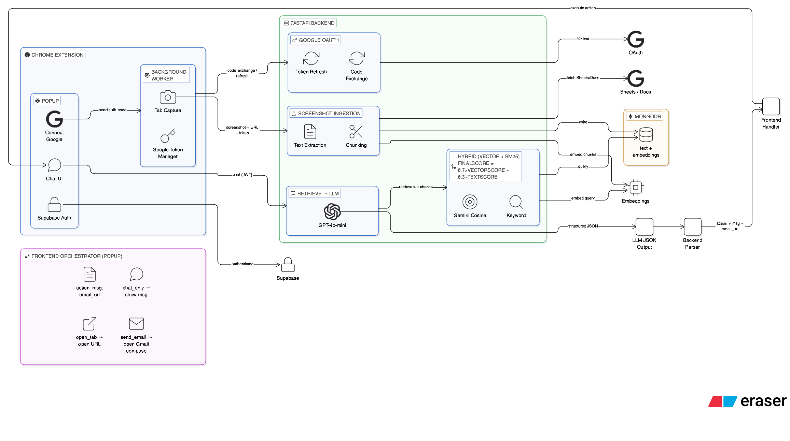

# Dex2

Dex2 is a Chrome extension plus FastAPI backend. The extension captures screenshots of visited pages, sends them to the backend for text extraction and embedding, and a chat UI queries the backend with RAG (retrieval-augmented generation). The backend uses hybrid retrieval (vector + BM25), returns structured actions (chat, open tab, send email), and the extension executes those actions.

## Architecture

---

## Project structure

- **backend/** – FastAPI app: embedding pipeline, hybrid retrieval, chat with action orchestration, Google OAuth and Sheets/Docs text extraction.
- **frontend/** – Chrome extension (Manifest V3): popup chat UI (React), background service worker (screenshots, Google token storage), and tools (open tab, open Gmail compose).

---

## Backend

### Hybrid retrieval

Retrieval combines two strategies over the same document set (user-scoped chunks in MongoDB):

1. **Vector (semantic) search** – The query is embedded with Gemini (`models/gemini-embedding-001`). Each stored chunk has an embedding; cosine similarity between query and chunk gives a score. This finds content that *means* the same thing (e.g. "that database thing" matching a chunk about Postgres).

2. **BM25 (keyword) search** – The query and chunk texts are tokenized (lowercase, split on non-alphanumeric). BM25Okapi scores chunks by exact token overlap. This finds names, URLs, IDs, and dates that vectors can miss (e.g. "did I visit docs.google.com/spreadsheets/..." matching a chunk containing that URL).

Scores are merged with configurable weights:

- `finalScore = (vector_weight * vectorScore) + (text_weight * textScore)`
- Default: 70% vector, 30% text (`RETRIEVAL_VECTOR_WEIGHT=0.7`, `RETRIEVAL_TEXT_WEIGHT=0.3`).
- Vector scores are clamped to [0, 1]; BM25 scores are normalized by the max over the result set so both contribute in a similar range.
- Chunks with `finalScore` below a threshold are dropped (default `RETRIEVAL_MIN_SCORE=0.35`). Remaining chunks are sorted by `finalScore` and the top `k` are returned.

All three values are configurable via environment variables in `langchain_agent.py` (or by passing `vector_weight`, `text_weight`, `min_score` into `retrieve_documents`).

### Action orchestration

Chat is RAG plus structured output:

1. **Retrieve** – The user message is used as the retrieval query. Hybrid retrieval returns top-k chunks (default k=4) from MongoDB, filtered by the user's Supabase token. Chunks are formatted into a single context string.

2. **Prompt** – A system prompt tells the LLM (OpenAI GPT-4o-mini) to answer using the context and to respond with JSON: `action` plus `msg`, and for `send_email` also `email_to`, `email_subject`, `email_body`. Action rules:
   - **open_tab** – User asks to open a URL or go somewhere; the LLM must put the URL in `msg` so the client can open it.
   - **send_email** – User asks to compose/send an email; the LLM must fill the email fields so the client can open a Gmail draft.
   - **chat_only** – All other replies (Q&A, explanations).

3. **Parse** – The backend extracts JSON from the LLM response (regex fallback if wrapped in text), maps `action` to the enum (`chat_only`, `open_tab`, `send_email`), and for `send_email` builds a Gmail compose URL from the email fields.

4. **Respond** – The API returns `ChatResponse`: `action`, `msg`, and optionally `email_url`. The frontend displays `msg` and, depending on `action`, calls `openTabFromMessage(msg)` (open tab), `openEmailCompose(email_url)` (open Gmail), or does nothing extra (chat only).

### API endpoints

| Method | Path | Description |
|--------|------|-------------|
| GET | `/` | Root; returns status. |
| GET | `/health` | Health check. |
| GET | `/api/items/{item_id}` | Example item (optional `q`). |
| POST | `/chat` | Chat with RAG. Body: `{ "message": string, "conversation_history": [{ "role", "content" }] }`. Header: `Authorization: Bearer <supabase_jwt>`. Returns: `{ "action": "chat_only" \| "open_tab" \| "send_email", "msg": string, "email_url": string \| null }`. |
| POST | `/api/embed-screenshot/` | Accept screenshot and URL; extract text, then enqueue embedding. Body: `ScreenshotRequest` (source_url, captured_at, title?, screenshot_data). Headers: `Authorization: Bearer <supabase_jwt>`, optional `X-Google-Access-Token` for Google Sheets/Docs. Returns 200 with status; 400 if text extraction fails. URLs under `accounts.google.com` are skipped (not embedded). |
| POST | `/api/google-auth/code` | Exchange OAuth code for tokens. Body: `{ "code", "redirect_uri" }`. Returns `{ "access_token", "refresh_token", "expires_in" }`. |
| POST | `/api/google-auth/refresh` | Refresh access token. Body: `{ "refresh_token" }`. Returns `{ "access_token", "expires_in" }`. |

### Backend setup

- Python 3, venv recommended. Install: `pip install -r requirements.txt`.
- Environment (e.g. `backend/.env`): `GOOGLE_API_KEY`, `OPENAI_API_KEY`, `MONGO_USERNAME`, `MONGO_PASSWORD`; for Google OAuth and Sheets/Docs: `GOOGLE_CLIENT_ID`, `GOOGLE_CLIENT_SECRET`. Optional retrieval tuning: `RETRIEVAL_VECTOR_WEIGHT`, `RETRIEVAL_TEXT_WEIGHT`, `RETRIEVAL_MIN_SCORE`.
- Run: `uvicorn main:app --reload` (or `python main.py`). API: http://localhost:8000; docs: http://localhost:8000/docs.

---

## Frontend (Chrome extension)

### Structure

- **Popup** – React app (Vite) loaded when the user clicks the extension icon. Shows login/signup (Supabase) and, when authenticated, the chat UI. "Connect Google" runs OAuth in the popup; the authorization code is sent to the background script, which exchanges it with the backend and stores tokens in `chrome.storage.local` so they persist after the popup closes.
- **Background service worker** – Listens for tab activation and tab updates; captures the visible tab with `chrome.tabs.captureVisibleTab`, then POSTs the screenshot and URL to `/api/embed-screenshot/`. Attaches Supabase JWT and, when available, Google access token (from storage, refreshed if needed). Also handles the `GOOGLE_AUTH_SAVE` message from the popup to perform the code exchange and write tokens to storage.
- **Tools** – `openTabFromMessage(content)`: parses the first URL from the assistant message and opens it in a new tab (used for `open_tab`). `openEmailCompose(emailUrl)`: opens the Gmail compose URL in a new tab (used for `send_email`).

### Action handling in the popup

After each chat response, the frontend reads `action` and `msg` (and `email_url` for send_email). If `action === "open_tab"`, it calls `openTabFromMessage(msg)`. If `action === "send_email"` and `email_url` is present, it calls `openEmailCompose(email_url)`. Otherwise it only shows the message (chat only).

### Frontend setup

- Node 18+. Install: `npm install`. Env: `frontend/.env` with `VITE_SUPABASE_URL`, `VITE_SUPABASE_ANON_KEY`, and `VITE_GOOGLE_CLIENT_ID` (for Connect Google). Build: `npm run build`. Load the **built** extension from `frontend/dist` in Chrome (chrome://extensions, "Load unpacked", select `dist`). The backend must be running (e.g. http://localhost:8000) and the extension's API_URL in the background script must match.

### Google Sheets/Docs

To embed content from Google Sheets or Docs, the user clicks "Connect Google" in the popup and completes OAuth (Web application client; redirect URI `https://<extension-id>.chromiumapp.org/`). The backend then uses the user's access token with the Sheets and Docs APIs to extract text when the screenshot URL is a Google Sheets or Docs link. Without Connect Google, those URLs return 401 and are not embedded.

---

## Running the full stack

1. Start the backend from `backend/`: `uvicorn main:app --reload` (or `python main.py`).
2. Build the frontend from `frontend/`: `npm run build`.
3. In Chrome, load the unpacked extension from `frontend/dist`.
4. Open the extension popup, sign in (Supabase), optionally Connect Google, and use the chat. Visiting pages will capture screenshots and send them to the backend for embedding; chat uses hybrid retrieval over those embeddings and returns actions the extension can execute.
