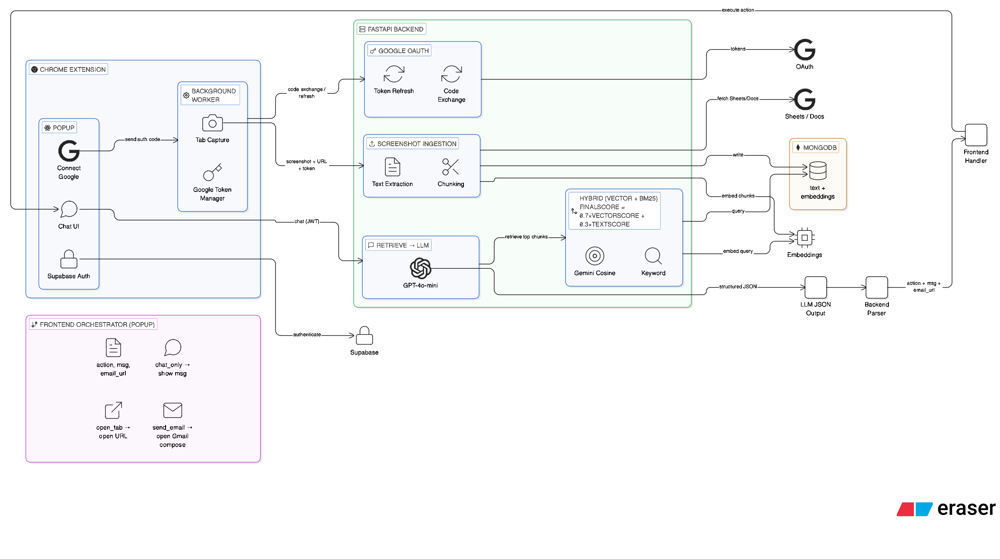

# Dex2

Dex2 is a Chrome extension plus FastAPI backend. The extension captures screenshots of visited pages, sends them to the backend for text extraction and embedding, and a chat UI queries the backend with RAG (retrieval-augmented generation). The backend uses hybrid retrieval (vector + BM25) and a tool-calling agent: the LLM (OpenAI GPT-4o-mini) chooses among tools (open tab, send email, edit slides) or answers in text. The API returns a single action per request (chat only, open tab, send email, or edit slides), and the extension executes the corresponding action.

## Architecture

### Demo

[Watch the demo](https://www.youtube.com/watch?v=fhYGrfLmNnQ)

---

## Project structure

- **backend/** – FastAPI app: embedding pipeline, hybrid retrieval, chat with tool-calling agent (open_tab, send_email, edit_slides), Google OAuth and Sheets/Docs/Slides integration.
- **frontend/** – Chrome extension (Manifest V3): popup chat UI (React), background service worker (screenshots, Google token storage), and tools (open tab, open Gmail compose, edit slides).

---

## Backend

### Hybrid retrieval

Retrieval combines two strategies over the same document set (user-scoped chunks in MongoDB):

1. **Vector (semantic) search** – The query is embedded with Gemini (`models/gemini-embedding-001`). Each stored chunk has an embedding; cosine similarity between query and chunk gives a score. This finds content that *means* the same thing (e.g. "that database thing" matching a chunk about Postgres).

2. **BM25 (keyword) search** – The query and chunk texts are tokenized (lowercase, split on non-alphanumeric). BM25Okapi scores chunks by exact token overlap. This finds names, URLs, IDs, and dates that vectors can miss (e.g. "did I visit docs.google.com/spreadsheets/..." matching a chunk containing that URL).

Scores are merged with configurable weights:

- `finalScore = (vector_weight * vectorScore) + (text_weight * textScore)`
- Default: 70% vector, 30% text (`RETRIEVAL_VECTOR_WEIGHT=0.7`, `RETRIEVAL_TEXT_WEIGHT=0.3`).
- Vector scores are clamped to [0, 1]; BM25 scores are normalized by the max over the result set so both contribute in a similar range.
- Chunks with `finalScore` below a threshold are dropped (default `RETRIEVAL_MIN_SCORE=0.35`). Remaining chunks are sorted by `finalScore` and the top `k` are returned.

All three values are configurable via environment variables in `langchain_agent.py` (or by passing `vector_weight`, `text_weight`, `min_score` into `retrieve_documents`).

### Tool-calling agent and context

Chat uses RAG plus a single-round tool-calling flow:

1. **Context** – The prompt is built from: (a) retrieved chunks from hybrid search (top-k, default k=4, user-scoped by Supabase token), (b) the user message, (c) the current browser tab URL (when provided), (d) conversation history, and (e) current time. This acts as a context composer so the LLM can choose tools or answer using the right information.

2. **Tools** – The LLM (OpenAI GPT-4o-mini via `langchain-openai`) is given three tools via `bind_tools`:
   - **open_tab** – When the user wants to open a URL or search; parameters: `url` (required), optional `message`. The backend returns `action: "open_tab"` and `msg` containing the message and URL so the frontend can open the tab.
   - **send_email** – When the user wants to compose/send an email; parameters: `email_to`, `email_subject`, `email_body`. The backend builds a Gmail compose URL and returns `action: "send_email"`, `msg`, and `email_url`.
   - **edit_slides** – When the user is on a Google Slides tab (URL contains `docs.google.com/presentation`) and asks to modify or query the presentation; no parameters. The backend calls the slides orchestrator with the current tab URL, user message, and Google access token, then returns `action: "edit_slides"` and `msg` with the result.

3. **Single round** – One LLM invocation per request. If the model returns tool calls, the backend executes only the first tool (since the frontend supports one action per response), maps it to the response enum, and returns. If the model responds with text only, the backend returns `action: "chat_only"` and the model’s message.

4. **Respond** – The API returns `ChatResponse`: `action` (`chat_only`, `open_tab`, `send_email`, or `edit_slides`), `msg`, and optionally `email_url`. The frontend displays `msg` and, depending on `action`, opens a tab from `msg`, opens Gmail compose with `email_url`, handles edit_slides (e.g. show result or open Slides), or shows the message only.

### API endpoints

| Method | Path | Description |
|--------|------|-------------|
| GET | `/` | Root; returns status. |
| GET | `/health` | Health check. |
| GET | `/api/items/{item_id}` | Example item (optional `q`). |
| POST | `/chat` | Chat with RAG and tool-calling. Body: `{ "message": string, "conversation_history": [{ "role", "content" }], "current_tab_url": string \| null }`. Headers: `Authorization: Bearer <supabase_jwt>`, optional `X-Google-Access-Token` (for edit_slides). Returns: `{ "action": "chat_only" \| "open_tab" \| "send_email" \| "edit_slides", "msg": string, "email_url": string \| null }`. |
| POST | `/api/embed-screenshot/` | Accept screenshot and URL; extract text, then enqueue embedding. Body: `ScreenshotRequest` (source_url, captured_at, title?, screenshot_data). Headers: `Authorization: Bearer <supabase_jwt>`, optional `X-Google-Access-Token` for Google Sheets/Docs. Returns 200 with status; 400 if text extraction fails. URLs under `accounts.google.com` are skipped (not embedded). |
| POST | `/api/google-auth/code` | Exchange OAuth code for tokens. Body: `{ "code", "redirect_uri" }`. Returns `{ "access_token", "refresh_token", "expires_in" }`. |
| POST | `/api/google-auth/refresh` | Refresh access token. Body: `{ "refresh_token" }`. Returns `{ "access_token", "expires_in" }`. |

### Backend setup

- Python 3, venv recommended. Install: `pip install -r requirements.txt`.
- Environment (e.g. `backend/.env`): `GOOGLE_API_KEY`, `OPENAI_API_KEY`, `MONGO_USERNAME`, `MONGO_PASSWORD`; for Google OAuth and Sheets/Docs: `GOOGLE_CLIENT_ID`, `GOOGLE_CLIENT_SECRET`. Optional retrieval tuning: `RETRIEVAL_VECTOR_WEIGHT`, `RETRIEVAL_TEXT_WEIGHT`, `RETRIEVAL_MIN_SCORE`.
- Run: `uvicorn main:app --reload` (or `python main.py`). API: http://localhost:8000; docs: http://localhost:8000/docs.

---

## Frontend (Chrome extension)

### Structure

- **Popup** – React app (Vite) loaded when the user clicks the extension icon. Shows login/signup (Supabase) and, when authenticated, the chat UI. "Connect Google" runs OAuth in the popup; the authorization code is sent to the background script, which exchanges it with the backend and stores tokens in `chrome.storage.local` so they persist after the popup closes.
- **Background service worker** – Listens for tab activation and tab updates; captures the visible tab with `chrome.tabs.captureVisibleTab`, then POSTs the screenshot and URL to `/api/embed-screenshot/`. Attaches Supabase JWT and, when available, Google access token (from storage, refreshed if needed). Also handles the `GOOGLE_AUTH_SAVE` message from the popup to perform the code exchange and write tokens to storage.
- **Tools** – `openTabFromMessage(content)`: parses the first URL from the assistant message and opens it in a new tab (used for `open_tab`). `openEmailCompose(emailUrl)`: opens the Gmail compose URL in a new tab (used for `send_email`).

### Action handling in the popup

After each chat response, the frontend reads `action`, `msg`, and optionally `email_url`. If `action === "open_tab"`, it calls `openTabFromMessage(msg)`. If `action === "send_email"` and `email_url` is present, it calls `openEmailCompose(email_url)`. If `action === "edit_slides"`, it shows the slides result in `msg` (and may open or focus the Slides tab as needed). Otherwise it only shows the message (chat only).

### Frontend setup

- Node 18+. Install: `npm install`. Env: `frontend/.env` with `VITE_SUPABASE_URL`, `VITE_SUPABASE_ANON_KEY`, and `VITE_GOOGLE_CLIENT_ID` (for Connect Google). Build: `npm run build`. Load the **built** extension from `frontend/dist` in Chrome (chrome://extensions, "Load unpacked", select `dist`). The backend must be running (e.g. http://localhost:8000) and the extension's API_URL in the background script must match.

### Google Sheets/Docs

To embed content from Google Sheets or Docs, the user clicks "Connect Google" in the popup and completes OAuth (Web application client; redirect URI `https://<extension-id>.chromiumapp.org/`). The backend then uses the user's access token with the Sheets and Docs APIs to extract text when the screenshot URL is a Google Sheets or Docs link. Without Connect Google, those URLs return 401 and are not embedded.

---

## Running the full stack

1. Start the backend from `backend/`: `uvicorn main:app --reload` (or `python main.py`).
2. Build the frontend from `frontend/`: `npm run build`.
3. In Chrome, load the unpacked extension from `frontend/dist`.
4. Open the extension popup, sign in (Supabase), optionally Connect Google, and use the chat. Visiting pages will capture screenshots and send them to the backend for embedding; chat uses hybrid retrieval and the tool-calling agent to return one action per request (chat only, open tab, send email, or edit slides) that the extension can execute.
